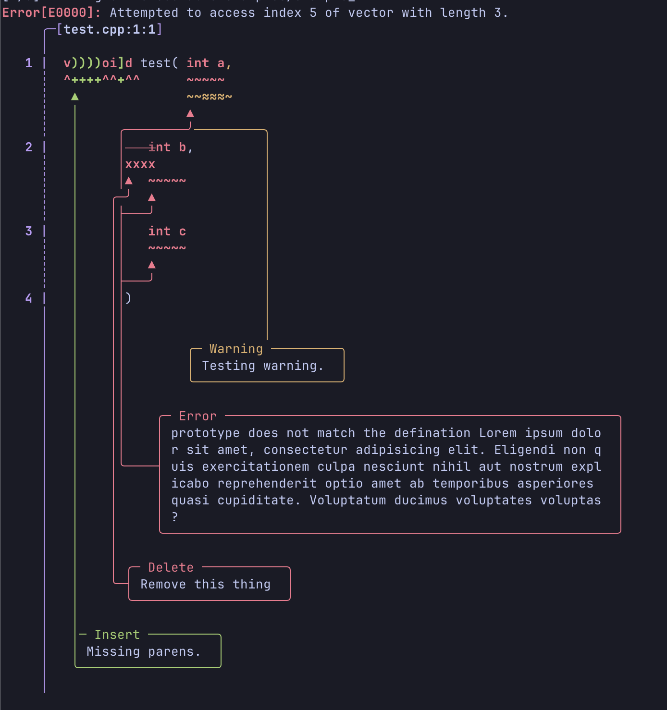
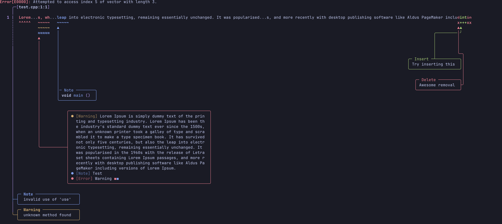

# Diagnostics
A diagnostic library for printing compiler diagnostics.

# Inspiration 

- The diagnostic architecture is based on [Google's Carbon Language](https://github.com/carbon-language/carbon-lang) diagnostic implementation, but not the exact implementation.
- `CowString` is inspired by Rust's `Cow` implementation.
- The error reporting or rendering on the terminal is closer to the Rust's.
- `Stream` has similar interface to llvm's `raw_ostream` with extensions.

# Basic Concepts

## 1. Span
- `Span` is an absolute position inside the source string. This does not accept signed positions.
- `LocRelSpan` is a relative position that represent a subsection of the source that will be print by the diagnostic. It is similar to `Span` if the subsection is same as the whole source. This does not accept signed positions.
- `MarkerRelSpan` represent position relative to marker, which could be a negative offset.

```
Source: |xxxxxxxxxxxxxxx|xxxxxxxxxxxxxxxxxxxxxxxxxxxxxxxxxxxxxxx|xxxxxxxxxxx|
        ^		|		                        |
        |		|	    			        |
        Span		|xxxxxxxxxxxxxxxxxx^^^^^xxxxxxxxxxxxxxxx|
                        ^                  ^
                        |                  |
                        LocRelSpan         MarkerRelSpan
```

## 2. Context
This provides more information to the current diagnostic that will be rendered below the marked span.

```
Source: |xxxxxxxxxxxxxxxxxxxxxxxxxxxxxxxxxxxxxxxxxxxxxxxxxxxxxxxxxxxxxxxxx|
                                ^				^
                                |				|
                                |				This is an error
                                |- This is a second error.
```

## 3. Sub-Diagnostic
This helps the user to add multiple sub-diagnostics that is related to the current parent diagnostics; such as adding history or backtrace to the current diagnostic.

## 4. Token Diagnostic Location
This is a type of location that allows the user to pass individual tokens with custom styles (color and bold). It does not allow escape characters, and they'll be escaped.

## 5. Basic Diagnostic Location
This is a single string source that supports newlines and could be split into multiple lines or skipped if it has too many lines that don't have diagnostic.

## 6. Diagnostic Converter
This is a custom struct or class that inherits from the `BasicDiagnosticConverter<LocT, DiagnosticKind>`. It allows the user to customise or build diagnostic location to the diagnostic builder.

## 7. Consumer
This an object that consumes the diagnostics, which could a consumer that prints the diagnostics on the terminal or sorts the consumers. These consumers can be plugged into each other; such as plugging sort and stream consumers, which will sort first then print it on the terminal.
There are three predefined consumers:
- `BasicStreamDiagnosticConsumer<DiagnosticKind>` This outputs the diagnostic to the `Stream`
- `BasicErrorTrackingDiagnosticConsumer<DiagnosticKind>` This tracks the error. If it encounters error, the error flag will be turned on.
- `BasicSortingDiagnosticConsumer<DiagnosticKind>` This sorts the diagnostics and needs a explicit flush.
## 8. Stream
This is an object that wraps standard out file descriptor, `std::ostream`, or `llvm::raw_ostream` (if `DARK_LLVM_OS_STREAM` is defined). This has almost similar interface to llvm's `raw_ostream` like `change_color` , `reset_color`, `Color` (enum)
```cpp
#include <diagnostics.hpp>
int main() {
	dark::out().change_color(dark::Stream::RED) << "Hello";
	dark::out().change_color(dark::Stream::Color::GREEN, { .bold = true }) << " World";
	dark::out().reset_color();
}
```

## 9. Format String
This uses `std::format` under the hood. Therefore, any valid format string is a valid string. However, the user can specify data types that will be checked at compile-time.
Valid type specifier:
- `c` for char
- `s` for string that could be both dynamic or static that will be stored inside the `CowString`
- `u8`, `u16`, `u32`, and `u64`
- `i8`, `i16`, `i32`, and `i64`
- `f32` and `f64`
- no type indicates any

```
"This is {s} with {}" // valid
"This is {u32:<20} with {}" // valid
"This is {0} with {}" // invalid
```

# How to use
This library is a C++ header only library so it very easy to use. You can clone the repo and add the include path to the `include` folder inside the cloned repo.

1. Clone the repo
```sh
git clone git@github.com:amitsingh19975/diagnostics.git
```
2. Include it in your project
```cmake
# If you're using CMake
include_directories(repo_path/diagnostics/include)
```
```sh
# You could pass -I flag while compiling
cc -Irepo_path/diagnostics/include my_program
```
3. Including the header inside the C++ project
 ```cpp
 #include <diagnostics.hpp>
 int main() {
	 // ....
 }
```

# Usage
## Defining Diagnostic Converter
```cpp
#include <diagnostics.hpp>

enum class DiagnosticKind {
    InvalidFunctionDefinition,
    InvalidFunctionPrototype
};

/*
* 1. line number and column number are 1-based so if the user gives 0 then the location will not be printed.
*/
struct SimpleConverter: BasicDiagnosticConverter<unsigned, DiagnosticKind> {
    auto convert_loc(unsigned loc, [[maybe_unused]] builder_t builder) const -> dark::DiagnosticLocation override {
        return dark::DiagnosticLocation {
            .filename = "test.cpp",
            .source = dark::BasicDiagnosticLocationItem {
                .source = "void test( int a, int c );", // Subsection
                .line_number = 1, // Line where the marker starts.
                .column_number = loc + 1, // Column where the marker starts
                .source_location = 0, // This is an absolute position inside the original source.
                .length = 2 // Length of the diagnostic marker
            }
        };
    }
};

```

## Using The Diagnostic Builder
```cpp
int main() {
	auto consumer = dark::BasicStreamDiagnosticConsumer<DiagnosticKind>(dark::out());
    auto converter = SimpleConverter();
    auto emitter = dark::BasicDiagnosticEmitter(
        converter,
        consumer
    );

    static constexpr auto InvalidFunctionDefinition = dark_make_diagnostic_with_kind(
        DiagnosticKind::InvalidFunctionDefinition,
        "Invalid function definition for {s} at {u32}"
    );

    static constexpr auto InvalidFunctionPrototype = dark_make_diagnostic_with_kind(
        DiagnosticKind::InvalidFunctionPrototype,
        "The prototype is defined here"
    );

    emitter
        .error(1, InvalidFunctionDefinition, "Test", 0u)
        .context(
            dark::DiagnosticContext()
                .insert(")", 2)
                .insert_marker_rel(")", 3)
                .del(dark::MarkerRelSpan(4, 8))
                .error(
                    "prototype does not match the defination",
                    dark::LocRelSpan(0, 2),
                    dark::Span(19, 24)
                )
                .warn(dark::Span(6, 10), dark::Span(25, 27))
                .note("Try to fix the error")
        )
        .sub_diagnostic()
            .warn(0, InvalidFunctionPrototype)
        .build()
        .emit();


}
```

## Note:
You can see more examples inside the example folder.

# Outputs/Screenshots

## Example 1


## Example 2


## Example 3


## Example 4

